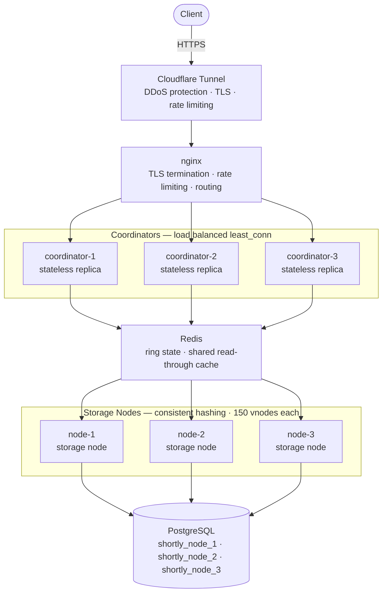

# Shortly: A Distributed URL Shortener

## Overview

Shortly is a horizontally scaled URL shortening service built to demonstrate the core mechanics of distributed systems design: consistent hashing, replicated stateless coordination, shared caching, and independent storage nodes. Rather than a single Flask process backed by SQLite, Shortly is composed of multiple cooperating services, each with a distinct responsibility, orchestrated through Docker Compose and fronted by an nginx gateway.

The project was built to explore, in a hands on way, how a link shortening service could be designed to scale horizontally: distributing writes across multiple storage nodes using consistent hashing, avoiding a single point of failure at the coordination layer through replication, and using a shared cache to absorb read traffic before it reaches storage.

Live deployment: https://thiyaga.dev

---

## Problem Statement

A URL shortener is a deceptively simple idea that exposes many real distributed systems problems once it needs to scale beyond a single process and a single database file:

- How do you distribute stored links across multiple storage backends without a central bottleneck deciding where every link lives.
- How do you keep the request coordinating layer itself from becoming a single point of failure.
- How do you avoid every read hitting a database round trip when a large fraction of links are requested repeatedly.
- How do you add or remove a storage node without reshuffling the entire dataset.

Shortly is structured specifically to answer these questions with a working implementation rather than a theoretical description.

---

## Architecture

### High level topology



### Component responsibilities

**nginx (public gateway)**
Terminates TLS, applies per route rate limiting, blocks administrative endpoints from public access, and load balances across the three coordinator replicas using a least connections strategy. It also serves the built React frontend directly and routes API and redirect traffic to the coordinators.

**Coordinator (3 replicas)**
The coordinator is a stateless Flask service. Its only job is to determine which storage node owns a given key, using a consistent hash ring, and forward the request to that node. Because the coordinator holds no local state beyond an in memory ring cache that is refreshed from Redis, any of the three replicas can serve any request, and losing one replica does not lose any data or in flight ring state.

**Consistent hash ring**
The ring assigns each storage node a number of virtual nodes (150 by default), positioned on a hash space using SHA-256. Distributing physical nodes across many virtual positions keeps load evenly spread even when a node is added or removed, and only the affected fraction of keys need to move, rather than the entire keyspace. Ring state itself is persisted in Redis so all coordinator replicas observe the same ring without needing direct coordination between themselves.

**Redis (shared cache and ring state)**
Redis serves two distinct purposes in this system. First, it is the source of truth for the current ring membership, allowing any coordinator replica to reconstruct the same ring on startup or after a change. Second, it functions as a read through cache for resolved short links, so that repeated requests for the same short URL are served without a round trip to the owning storage node or its database.

**Storage nodes (3 replicas)**
Each storage node is an independent Flask service responsible for a partition of the total keyspace, as determined by the consistent hash ring. Each node owns its own logical Postgres database, meaning storage nodes do not share tables and cannot conflict with one another. Nodes expose endpoints for creating links, resolving links, and exporting a range of keys, which supports migrating data when ring membership changes.

**Postgres**
A single Postgres instance hosts three separate logical databases, one per storage node, keeping each node's data physically isolated at the schema level while sharing the same underlying database server for this deployment's scale.

**Frontend**
A React and TypeScript single page application, built with Vite and styled with Tailwind CSS, presents the live state of the ring, cache statistics, and a form to create shortened URLs. The frontend polls a read only statistics endpoint on the coordinator every five seconds and renders the current distribution of virtual nodes across storage nodes, along with live cache hit and miss counts.

---

## Request Flow

### Creating a short URL

1. The client submits a request to `/shorten` with the original URL and an optional expiry.
2. nginx applies rate limiting and forwards the request to one of the three coordinator replicas.
3. The coordinator hashes the request key against the consistent hash ring to determine the owning storage node.
4. The coordinator forwards the creation request to that storage node.
5. The storage node generates a short identifier, writes the mapping to its own Postgres database, and returns the result.
6. The coordinator populates the shared Redis cache with the new mapping and returns the shortened URL to the client, rewritten to use the public facing host.

### Resolving a short URL

1. The client requests `/<short_id>`.
2. The coordinator first checks the shared Redis cache. If the mapping is present, it issues a redirect immediately without contacting any storage node.
3. On a cache miss, the coordinator consults the consistent hash ring to determine the owning storage node, forwards the resolution request, and caches the result for subsequent requests before redirecting the client.

### Ring membership changes

When a storage node is added or removed, only the keys that fall within the affected portion of the hash ring need to move. Storage nodes expose an export endpoint that returns all keys within a given range, and a migrate endpoint that accepts a batch of keys, which together allow data to be moved incrementally rather than requiring a full dataset rebuild.

---

## Technology Stack

**Backend**
Python, Flask, Gunicorn

**Storage**
PostgreSQL, one logical database per storage node

**Caching and coordination state**
Redis, used both as a shared cache and as the persistence layer for consistent hash ring membership

**Frontend**
React, TypeScript, Vite, Tailwind CSS

**Gateway and load balancing**
nginx, with TLS termination, per route rate limiting, and least connections load balancing across coordinator replicas

**Containerization and orchestration**
Docker, Docker Compose

**Public access**
Cloudflare Tunnel, providing outbound only connectivity from the host machine to a public domain without requiring inbound firewall rules

---

## API Reference

### Create a short URL

`POST /shorten`

Request body:
```json
{
  "org_url": "https://www.example.com",
  "expiry_days": 7
}
```

Response:
```json
{
  "short_url": "https://thiyaga.dev/abc123",
  "org_url": "https://www.example.com",
  "expires_at": "2026-07-14T00:00:00"
}
```

### Resolve a short URL

`GET /<short_id>`

Returns an HTTP 302 redirect to the original URL if the mapping exists and has not expired. Returns HTTP 404 if the identifier does not exist, and HTTP 410 if it has expired.

### Link metadata

`GET /api/info/<short_id>`

Returns metadata for a given short link, including the original URL and any associated tracking information maintained by the owning storage node.

### Live statistics

`GET /api/stats`

Returns a read only snapshot of current ring composition, per node virtual node distribution, load balance standard deviation, and cache hit, miss, and eviction counts. This endpoint powers the live frontend dashboard and requires no authentication, as it exposes only aggregate operational state.

### Health check

`GET /health`

Returns the health status of the coordinator, including Redis connectivity and the number of currently registered storage nodes. Used for container health checks and uptime monitoring.

### Administrative endpoints

Endpoints under `/admin` manage ring membership directly, including adding, listing, and removing storage nodes, and inspecting or clearing cache state. These endpoints require an API key and are blocked at the nginx layer from public access, remaining reachable only from within the internal Docker network.

---

## Design Decisions and Tradeoffs

**Why consistent hashing rather than a fixed modulo scheme**
A modulo based partitioning scheme requires remapping nearly the entire keyspace whenever a node is added or removed, since the divisor changes. Consistent hashing with virtual nodes limits the affected keyspace to roughly the fraction owned by the node being added or removed, making the system considerably more tolerant of scaling events.

**Why three stateless coordinator replicas rather than one**
Placing all ring lookup logic behind a single coordinator process would reintroduce a single point of failure at the exact layer meant to distribute load. By keeping the coordinator entirely stateless, with ring state reconstructed from Redis on demand, any replica can be restarted or lost without affecting correctness, and nginx can freely load balance across all three.

**Why a shared cache rather than per node caching**
A per node cache would only capture hits for requests that happen to land on the same coordinator replica twice, since replicas are otherwise interchangeable. A single shared Redis cache guarantees that a cache warm from any replica benefits all subsequent requests regardless of which replica receives them.

**Why one Postgres database per node rather than one shared database**
Isolating each storage node's data at the database level closely mirrors how this system would be deployed if each storage node ran on entirely separate physical hardware, and it removes any possibility of accidental cross node data access at the schema level, even though all three databases currently share one Postgres server for this deployment's scale.

**Connection pooling**
The stack includes pgbouncer as a connection pooling layer between storage nodes and Postgres. In the current deployment, each storage node maintains its own application level connection pool using psycopg2, which is sufficient at this scale, and nodes connect directly to Postgres. pgbouncer remains present in the stack as the intended pooling layer for a deployment with a substantially higher number of concurrent node processes.

---

## Local Development

### Prerequisites

Docker and Docker Compose installed locally.

### Running the stack

```bash
docker compose up -d --build
```

This builds and starts postgres, redis, pgbouncer, three coordinator replicas, three storage nodes, the React frontend, and the nginx gateway.

### Registering storage nodes

On first startup, storage nodes must be registered with the consistent hash ring through the coordinator's administrative endpoint:

```bash
./scripts/register_nodes.sh
```

### Verifying the stack

```bash
docker compose ps
curl http://localhost:8888/health
```

### Accessing the dashboard

Open `http://localhost:8888` to view the live frontend, showing ring composition and cache statistics, and to create shortened URLs directly.

---

## Deployment

The production deployment runs the full Docker Compose stack on a persistent host and exposes it publicly through a Cloudflare Tunnel, which establishes an outbound only connection from the host to Cloudflare's edge network. This avoids the need to open inbound ports on the host's network and allows the public domain to remain stable independent of the host's network configuration.

---

## Current Hosting Note

The production deployment currently runs on a personal machine, exposed 
through a Cloudflare Tunnel rather than a cloud-hosted virtual machine. 
This was a deliberate choice during initial development to validate the 
full stack end to end without incurring hosting costs. The tradeoff is 
that availability depends on the host machine remaining powered on and 
connected.

A migration to a persistent cloud host, removing this dependency, is a 
planned next step and does not require any changes to the application 
architecture described above, since the entire stack is already 
containerized and portable.

---

## Possible Extensions

Migrating ring state changes to be fully automated rather than requiring manual registration through the administrative API.

Introducing per node replicas so that the loss of a single storage node does not make its partition of the keyspace temporarily unavailable.

Adding structured request tracing across the coordinator and storage node boundary to make latency attribution easier during load testing.

---

## License

This project is licensed under the MIT License.
